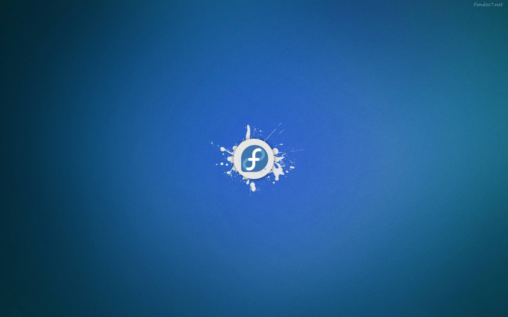

# Fedora Wallpapers

<table>
  <tr>
    <td align="center" width="33.33%" valign="top">
      
       
      <a href="./Cnsvoqp-fedora-linux-wallpaper.jpg" target="_blank" rel="noopener noreferrer"><b>Cnsvoqp-fedora-linux-wallpaper.jpg</b></a>
       
      <code>2560×1600</code> • <code>240 KB</code>
    </td>
    <td align="center" width="33.33%" valign="top">
      
       
      <a href="./Fonds%20D%20Cran%20Tux%20Planet.png" target="_blank" rel="noopener noreferrer"><b>Fonds D Cran Tux Planet.png</b></a>
       
      <code>1920×1080</code> • <code>175 KB</code>
    </td>
    <td align="center" width="33.33%" valign="top">
      
       
      <a href="./HR296pU-fedora-linux-wallpaper.jpg" target="_blank" rel="noopener noreferrer"><b>HR296pU-fedora-linux-wallpaper.jpg</b></a>
       
      <code>2560×1600</code> • <code>80 KB</code>
    </td>
  </tr>
  <tr>
    <td align="center" width="33.33%" valign="top">
      
       
      <a href="./KtU8gTn-fedora-wallpaper.jpg" target="_blank" rel="noopener noreferrer"><b>KtU8gTn-fedora-wallpaper.jpg</b></a>
       
      <code>1920×1200</code> • <code>161 KB</code>
    </td>
    <td align="center" width="33.33%" valign="top">
      
       
      <a href="./mVG29XH-fedora-linux-wallpaper.jpg" target="_blank" rel="noopener noreferrer"><b>mVG29XH-fedora-linux-wallpaper.jpg</b></a>
       
      <code>1920×1200</code> • <code>45 KB</code>
    </td>
    <td align="center" width="33.33%" valign="top">
      
       
      <a href="./tokyo-night-fedora.png" target="_blank" rel="noopener noreferrer"><b>tokyo-night-fedora.png</b></a>
       
      <code>3440×2160</code> • <code>4.2 MB</code>
    </td>
  </tr>
  <tr>
    <td align="center" width="33.33%" valign="top">
      
       
      <a href="./wallhaven-0qrrrq.png" target="_blank" rel="noopener noreferrer"><b>wallhaven-0qrrrq.png</b></a>
       
      <code>1920×1200</code> • <code>2.0 MB</code>
    </td>
    <td align="center" width="33.33%" valign="top">
      
       
      <a href="./wallhaven-3k6pyd.jpg" target="_blank" rel="noopener noreferrer"><b>wallhaven-3k6pyd.jpg</b></a>
       
      <code>3840×2160</code> • <code>201 KB</code>
    </td>
    <td align="center" width="33.33%" valign="top">
      
       
      <a href="./wallhaven-3l7q26.png" target="_blank" rel="noopener noreferrer"><b>wallhaven-3l7q26.png</b></a>
       
      <code>1920×1080</code> • <code>52 KB</code>
    </td>
  </tr>
  <tr>
    <td align="center" width="33.33%" valign="top">
      
       
      <a href="./wallhaven-4ovzj5.jpg" target="_blank" rel="noopener noreferrer"><b>wallhaven-4ovzj5.jpg</b></a>
       
      <code>1600×1000</code> • <code>36 KB</code>
    </td>
    <td align="center" width="33.33%" valign="top">
      
       
      <a href="./wallhaven-5g7zx3.png" target="_blank" rel="noopener noreferrer"><b>wallhaven-5g7zx3.png</b></a>
       
      <code>3440×1440</code> • <code>2.2 MB</code>
    </td>
    <td align="center" width="33.33%" valign="top">
      
       
      <a href="./wallhaven-6qp8zw.jpg" target="_blank" rel="noopener noreferrer"><b>wallhaven-6qp8zw.jpg</b></a>
       
      <code>3840×2160</code> • <code>171 KB</code>
    </td>
  </tr>
  <tr>
    <td align="center" width="33.33%" valign="top">
      
       
      <a href="./wallhaven-76ezqe.jpg" target="_blank" rel="noopener noreferrer"><b>wallhaven-76ezqe.jpg</b></a>
       
      <code>3840×2160</code> • <code>177 KB</code>
    </td>
    <td align="center" width="33.33%" valign="top">
      
       
      <a href="./wallhaven-95917w.jpg" target="_blank" rel="noopener noreferrer"><b>wallhaven-95917w.jpg</b></a>
       
      <code>3840×2160</code> • <code>219 KB</code>
    </td>
    <td align="center" width="33.33%" valign="top">
      
       
      <a href="./wallhaven-9d6r6d.png" target="_blank" rel="noopener noreferrer"><b>wallhaven-9d6r6d.png</b></a>
       
      <code>3840×2160</code> • <code>4.1 MB</code>
    </td>
  </tr>
  <tr>
    <td align="center" width="33.33%" valign="top">
      
       
      <a href="./wallhaven-d6m953.jpg" target="_blank" rel="noopener noreferrer"><b>wallhaven-d6m953.jpg</b></a>
       
      <code>1920×1080</code> • <code>25 KB</code>
    </td>
    <td align="center" width="33.33%" valign="top">
      
       
      <a href="./wallhaven-d6qlem.png" target="_blank" rel="noopener noreferrer"><b>wallhaven-d6qlem.png</b></a>
       
      <code>1920×1080</code> • <code>392 KB</code>
    </td>
    <td align="center" width="33.33%" valign="top">
      
       
      <a href="./wallhaven-d6ympj.png" target="_blank" rel="noopener noreferrer"><b>wallhaven-d6ympj.png</b></a>
       
      <code>3440×1440</code> • <code>9.7 MB</code>
    </td>
  </tr>
  <tr>
    <td align="center" width="33.33%" valign="top">
      
       
      <a href="./wallhaven-jxjoqy.png" target="_blank" rel="noopener noreferrer"><b>wallhaven-jxjoqy.png</b></a>
       
      <code>3440×1440</code> • <code>4.6 MB</code>
    </td>
    <td align="center" width="33.33%" valign="top">
      
       
      <a href="./wallhaven-kxp9rq.png" target="_blank" rel="noopener noreferrer"><b>wallhaven-kxp9rq.png</b></a>
       
      <code>3840×2160</code> • <code>15.9 MB</code>
    </td>
    <td align="center" width="33.33%" valign="top">
      
       
      <a href="./wallhaven-o5q8j7.png" target="_blank" rel="noopener noreferrer"><b>wallhaven-o5q8j7.png</b></a>
       
      <code>3440×1440</code> • <code>4.4 MB</code>
    </td>
  </tr>
  <tr>
    <td align="center" width="33.33%" valign="top">
      
       
      <a href="./wallhaven-od6pel.jpg" target="_blank" rel="noopener noreferrer"><b>wallhaven-od6pel.jpg</b></a>
       
      <code>3840×2160</code> • <code>209 KB</code>
    </td>
    <td align="center" width="33.33%" valign="top">
      
       
      <a href="./wallhaven-og6q8l.png" target="_blank" rel="noopener noreferrer"><b>wallhaven-og6q8l.png</b></a>
       
      <code>3840×2160</code> • <code>76 KB</code>
    </td>
    <td align="center" width="33.33%" valign="top">
      
       
      <a href="./wallhaven-pogy1e.png" target="_blank" rel="noopener noreferrer"><b>wallhaven-pogy1e.png</b></a>
       
      <code>2560×1440</code> • <code>3.7 MB</code>
    </td>
  </tr>
  <tr>
    <td align="center" width="33.33%" valign="top">
      
       
      <a href="./wallhaven-qdqdjl.png" target="_blank" rel="noopener noreferrer"><b>wallhaven-qdqdjl.png</b></a>
       
      <code>2560×1440</code> • <code>30 KB</code>
    </td>
    <td align="center" width="33.33%" valign="top">
      
       
      <a href="./wallhaven-yj2dr7.jpg" target="_blank" rel="noopener noreferrer"><b>wallhaven-yj2dr7.jpg</b></a>
       
      <code>3840×2160</code> • <code>165 KB</code>
    </td>
    <td width="33.33%"></td>
  </tr>
</table>
