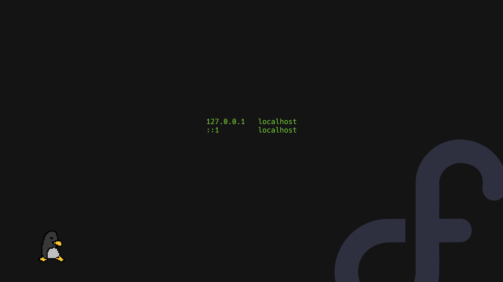

# 🖼️ Wallpapers

<table>
  <tr>
    <td align="center" width="33.33%" valign="top">
      
       
      <a href="./wallpaper-01.jpg" target="_blank" rel="noopener noreferrer"><b>wallpaper-01.jpg</b></a>
       
      <code>1920×1200</code> • <code>161 KB</code>
    </td>
    <td align="center" width="33.33%" valign="top">
      
       
      <a href="./wallpaper-02.png" target="_blank" rel="noopener noreferrer"><b>wallpaper-02.png</b></a>
       
      <code>3440×2160</code> • <code>4.2 MB</code>
    </td>
    <td align="center" width="33.33%" valign="top">
      
       
      <a href="./wallpaper-03.png" target="_blank" rel="noopener noreferrer"><b>wallpaper-03.png</b></a>
       
      <code>1920×1080</code> • <code>52 KB</code>
    </td>
  </tr>
  <tr>
    <td align="center" width="33.33%" valign="top">
      
       
      <a href="./wallpaper-04.png" target="_blank" rel="noopener noreferrer"><b>wallpaper-04.png</b></a>
       
      <code>3840×2160</code> • <code>31.7 MB</code>
    </td>
    <td align="center" width="33.33%" valign="top">
      
       
      <a href="./wallpaper-05.png" target="_blank" rel="noopener noreferrer"><b>wallpaper-05.png</b></a>
       
      <code>3840×2160</code> • <code>453 KB</code>
    </td>
    <td align="center" width="33.33%" valign="top">
      
       
      <a href="./wallpaper-06.jpg" target="_blank" rel="noopener noreferrer"><b>wallpaper-06.jpg</b></a>
       
      <code>3840×2160</code> • <code>1.8 MB</code>
    </td>
  </tr>
  <tr>
    <td align="center" width="33.33%" valign="top">
      
       
      <a href="./wallpaper-07.png" target="_blank" rel="noopener noreferrer"><b>wallpaper-07.png</b></a>
       
      <code>3440×1440</code> • <code>4.4 MB</code>
    </td>
    <td align="center" width="33.33%" valign="top">
      
       
      <a href="./wallpaper-08.png" target="_blank" rel="noopener noreferrer"><b>wallpaper-08.png</b></a>
       
      <code>1920×1080</code> • <code>240 KB</code>
    </td>
    <td align="center" width="33.33%" valign="top">
      
       
      <a href="./wallpaper-09.png" target="_blank" rel="noopener noreferrer"><b>wallpaper-09.png</b></a>
       
      <code>2560×1440</code> • <code>30 KB</code>
    </td>
  </tr>
  <tr>
    <td align="center" width="33.33%" valign="top">
      
       
      <a href="./wallpaper-10.png" target="_blank" rel="noopener noreferrer"><b>wallpaper-10.png</b></a>
       
      <code>3440×1440</code> • <code>2.2 MB</code>
    </td>
    <td align="center" width="33.33%" valign="top">
      
       
      <a href="./wallpaper-11.png" target="_blank" rel="noopener noreferrer"><b>wallpaper-11.png</b></a>
       
      <code>3440×1440</code> • <code>4.6 MB</code>
    </td>
    <td align="center" width="33.33%" valign="top">
      
       
      <a href="./wallpaper-12.png" target="_blank" rel="noopener noreferrer"><b>wallpaper-12.png</b></a>
       
      <code>3840×2160</code> • <code>15.9 MB</code>
    </td>
  </tr>
  <tr>
    <td align="center" width="33.33%" valign="top">
      
       
      <a href="./wallpaper-13.png" target="_blank" rel="noopener noreferrer"><b>wallpaper-13.png</b></a>
       
      <code>3840×2160</code> • <code>76 KB</code>
    </td>
    <td align="center" width="33.33%" valign="top">
      
       
      <a href="./wallpaper-14.png" target="_blank" rel="noopener noreferrer"><b>wallpaper-14.png</b></a>
       
      <code>1920×1080</code> • <code>1.8 MB</code>
    </td>
    <td align="center" width="33.33%" valign="top">
      
       
      <a href="./wallpaper-15.jpg" target="_blank" rel="noopener noreferrer"><b>wallpaper-15.jpg</b></a>
       
      <code>2560×1600</code> • <code>240 KB</code>
    </td>
  </tr>
  <tr>
    <td align="center" width="33.33%" valign="top">
      
       
      <a href="./wallpaper-16.png" target="_blank" rel="noopener noreferrer"><b>wallpaper-16.png</b></a>
       
      <code>1920×1080</code> • <code>175 KB</code>
    </td>
    <td align="center" width="33.33%" valign="top">
      
       
      <a href="./wallpaper-17.jpg" target="_blank" rel="noopener noreferrer"><b>wallpaper-17.jpg</b></a>
       
      <code>2560×1600</code> • <code>80 KB</code>
    </td>
    <td align="center" width="33.33%" valign="top">
      
       
      <a href="./wallpaper-18.jpg" target="_blank" rel="noopener noreferrer"><b>wallpaper-18.jpg</b></a>
       
      <code>1920×1200</code> • <code>45 KB</code>
    </td>
  </tr>
  <tr>
    <td align="center" width="33.33%" valign="top">
      
       
      <a href="./wallpaper-19.png" target="_blank" rel="noopener noreferrer"><b>wallpaper-19.png</b></a>
       
      <code>1920×1200</code> • <code>2.0 MB</code>
    </td>
    <td align="center" width="33.33%" valign="top">
      
       
      <a href="./wallpaper-20.jpg" target="_blank" rel="noopener noreferrer"><b>wallpaper-20.jpg</b></a>
       
      <code>3840×2160</code> • <code>201 KB</code>
    </td>
    <td align="center" width="33.33%" valign="top">
      
       
      <a href="./wallpaper-21.jpg" target="_blank" rel="noopener noreferrer"><b>wallpaper-21.jpg</b></a>
       
      <code>1600×1000</code> • <code>36 KB</code>
    </td>
  </tr>
  <tr>
    <td align="center" width="33.33%" valign="top">
      
       
      <a href="./wallpaper-22.jpg" target="_blank" rel="noopener noreferrer"><b>wallpaper-22.jpg</b></a>
       
      <code>3840×2160</code> • <code>171 KB</code>
    </td>
    <td align="center" width="33.33%" valign="top">
      
       
      <a href="./wallpaper-23.jpg" target="_blank" rel="noopener noreferrer"><b>wallpaper-23.jpg</b></a>
       
      <code>3840×2160</code> • <code>177 KB</code>
    </td>
    <td align="center" width="33.33%" valign="top">
      
       
      <a href="./wallpaper-24.jpg" target="_blank" rel="noopener noreferrer"><b>wallpaper-24.jpg</b></a>
       
      <code>3840×2160</code> • <code>219 KB</code>
    </td>
  </tr>
  <tr>
    <td align="center" width="33.33%" valign="top">
      
       
      <a href="./wallpaper-25.png" target="_blank" rel="noopener noreferrer"><b>wallpaper-25.png</b></a>
       
      <code>3840×2160</code> • <code>4.1 MB</code>
    </td>
    <td align="center" width="33.33%" valign="top">
      
       
      <a href="./wallpaper-26.jpg" target="_blank" rel="noopener noreferrer"><b>wallpaper-26.jpg</b></a>
       
      <code>1920×1080</code> • <code>25 KB</code>
    </td>
    <td align="center" width="33.33%" valign="top">
      
       
      <a href="./wallpaper-27.png" target="_blank" rel="noopener noreferrer"><b>wallpaper-27.png</b></a>
       
      <code>1920×1080</code> • <code>392 KB</code>
    </td>
  </tr>
  <tr>
    <td align="center" width="33.33%" valign="top">
      
       
      <a href="./wallpaper-28.png" target="_blank" rel="noopener noreferrer"><b>wallpaper-28.png</b></a>
       
      <code>3440×1440</code> • <code>9.7 MB</code>
    </td>
    <td align="center" width="33.33%" valign="top">
      
       
      <a href="./wallpaper-29.jpg" target="_blank" rel="noopener noreferrer"><b>wallpaper-29.jpg</b></a>
       
      <code>3840×2160</code> • <code>209 KB</code>
    </td>
    <td align="center" width="33.33%" valign="top">
      
       
      <a href="./wallpaper-30.png" target="_blank" rel="noopener noreferrer"><b>wallpaper-30.png</b></a>
       
      <code>2560×1440</code> • <code>3.7 MB</code>
    </td>
  </tr>
  <tr>
    <td align="center" width="33.33%" valign="top">
      
       
      <a href="./wallpaper-31.jpg" target="_blank" rel="noopener noreferrer"><b>wallpaper-31.jpg</b></a>
       
      <code>3840×2160</code> • <code>165 KB</code>
    </td>
    <td width="33.33%"></td>
    <td width="33.33%"></td>
  </tr>
</table>
