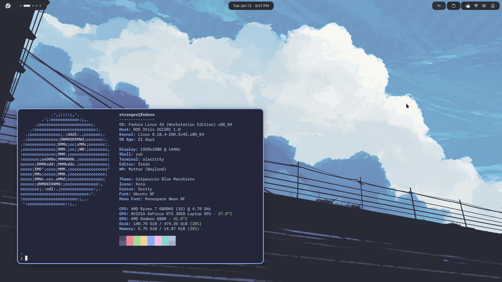
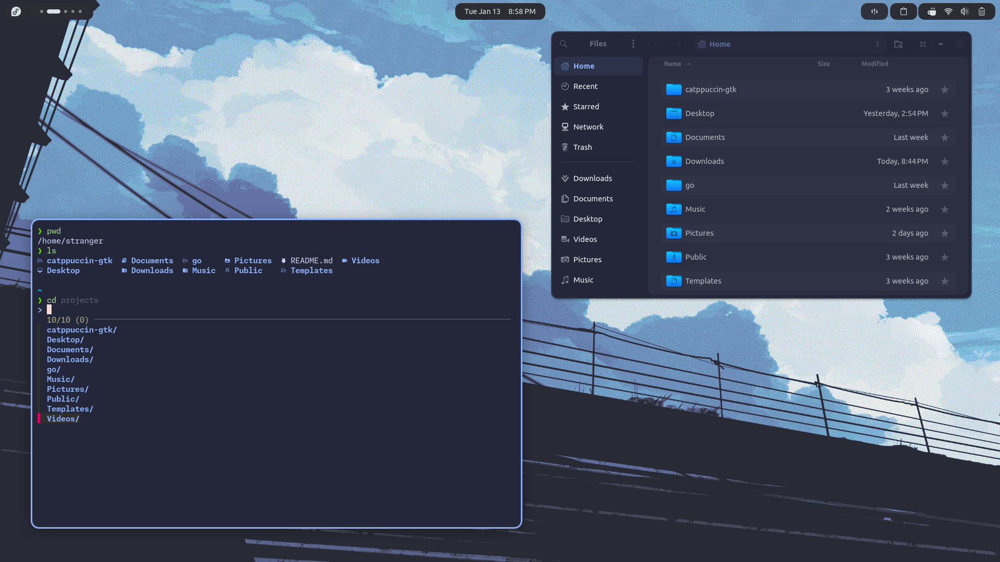
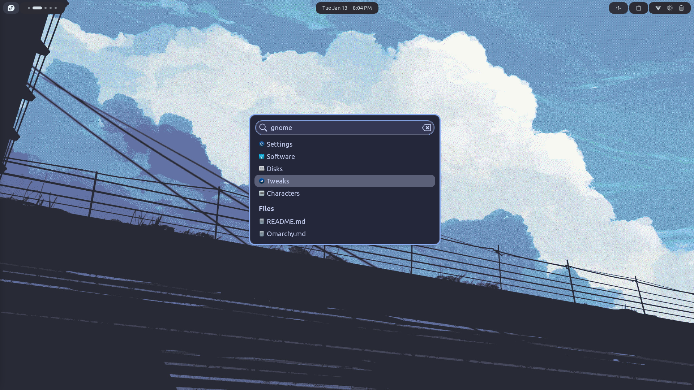
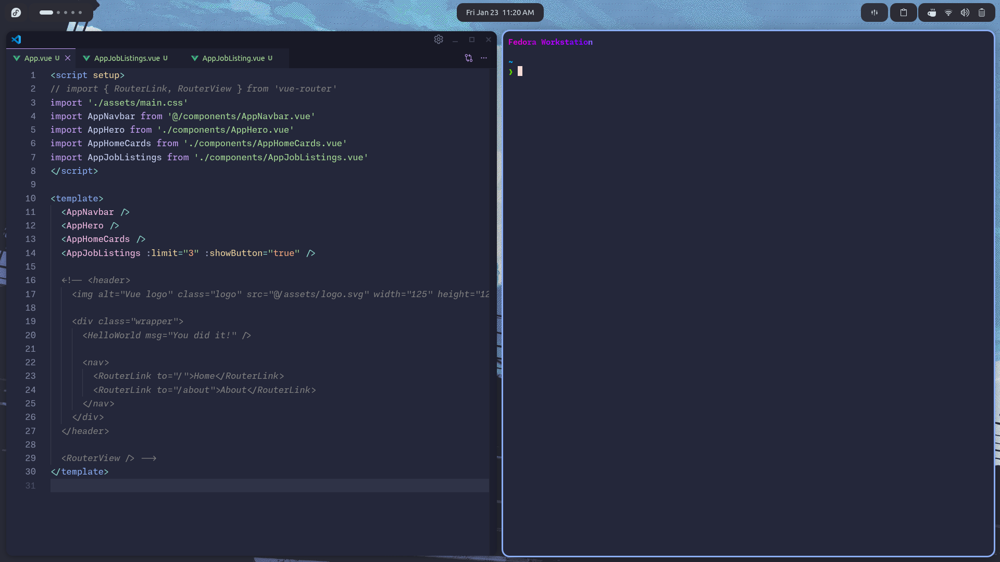
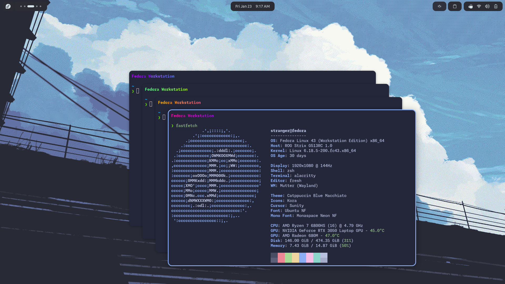
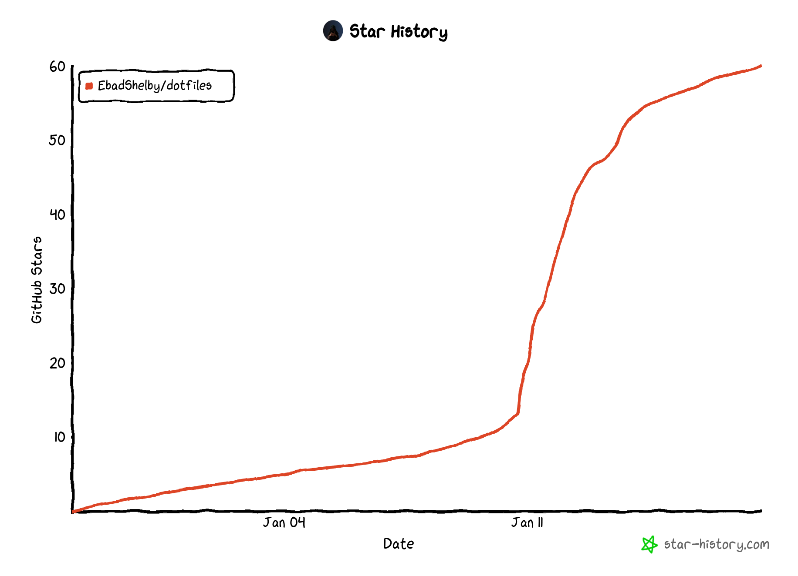

# 🐧 Fedora Workstation

---

## ⚡ My Setup

> Optimized for a **majestic, fast, and productive Fedora Workstation** experience.

---

### 🎨 GNOME Tweaks
- **Theme:** Catppuccin Dark Macchiato  
- **Icons:** Kora  
- **Cursor:** Sunity  
- **Font:** Ubuntu NF  
- **Mono Font:** Monaspace Neon NF  

---

### 🔌 GNOME Extensions
Added arcMenu, Tiling Shell, Open bar settings inside Downloads folder.
- `arcMenu`
    - `runner launcher`
- `Tiling Shell`
- `Blur my shell`
- `auto move windows`
- `Rounded window corners reborn`
- `AppIndicator and KStatusNotifierItem Support`
- `Caffeine`
- `Clipboard Indicator`
- `Dash to Dock`
- `Impatience`
- `Bring out Submenu of Power Off Button`
- `Just Perfection`
- `Open Bar`
- `Removable Drive Menu`
- `User Themes`
- `Vitals`
- `Status Area Horizontal Spacing`

---

### 🛠 Terminal & Tools
- **fastfetch**
- **alacritty**
- **fresh**
- **snapper**
- **grub-btrfs**
- **keyd-**
- **harlequin**
- **lazygit**
- **gh**
- **gitui**
- **phpmyadmin**
- **scrcpy**
- **btop**
- **tldr**
- **bat**
- **ncdu**
- **du-dust**
- **fd**
- **fzf**
- **ripgrep**
- **aria2**
- **lsd**
- **glow**
- **oh-my-zsh**
- **zsh** with plugins:
  - `zoxide`
  - `atuin`
  - `powerlevel10k`
  - `zsh-autosuggestions`
  - `zsh-syntax-highlighting`
  - `fzf-tab`

---

### 💻 My Apps

#### System
- btrfs-assistant
- Pika Backup
- Firewall
- Extension Manager
- Tweaks
- Flatseal
- rog-control-center
- Resources

#### Work
- VSCode
- DBeaver Community
- virt-manager
- GhostWriter
- ONLYOFFICE
- Anki
- Kanri

#### Media
- GPU Screen Recorder
- Audacity
- Kdenlive
- Easy Effects
- Video Downloader
- Upscaler
- Gradia

#### Web & Comms
- Brave
- Firefox with betterfox
- Signal Desktop
- LocalSend

#### Utilities
- Bitwarden

---

