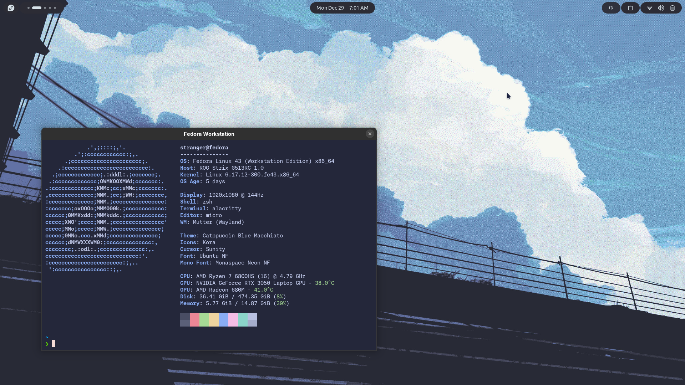

# 🐧 Fedora Workstation

---

## ⚡ My Setup

### 🛠 Terminal & Tools
- **fastfetch**
- **alacritty**
- **micro**
- **zsh** with plugins:
  - `zoxide`
  - `lsd`
  - `atuin`
  - `fzf`
  - `fd`
  - `ripgrep`
  - `oh-my-zsh`
  - `powerlevel10k`
  - `zsh-autosuggestions`
  - `zsh-syntax-highlighting`
  - `fzf-tab`

---

### 🎨 GNOME Tweaks
- **Theme:** Catppuccin Blue Macchiato  
- **Icons:** Kora  
- **Cursor:** Sunity  
- **Font:** Ubuntu NF  
- **Mono Font:** Monaspace Neon NF  

---

### 🔌 GNOME Extensions
- `arcMenu`
- `auto move windows`
- `Caffeine`
- `Clipboard Indicator`
- `Dash to Dock`
- `Impatience`
- `Just Perfection`
- `Open Bar`
- `Removable Drive Menu`
- `User Themes`

---

> This setup is optimized for a **beautiful, fast, and productive Fedora Workstation** experience.
