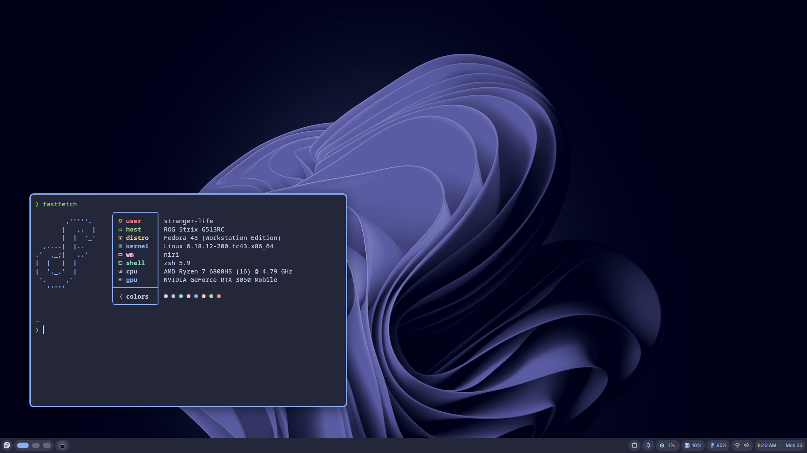
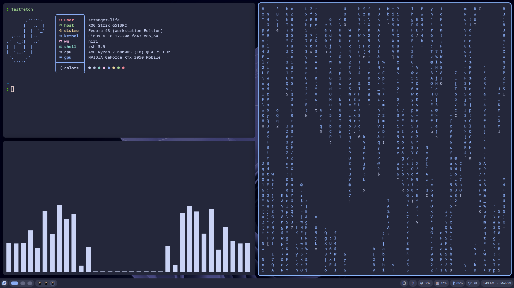
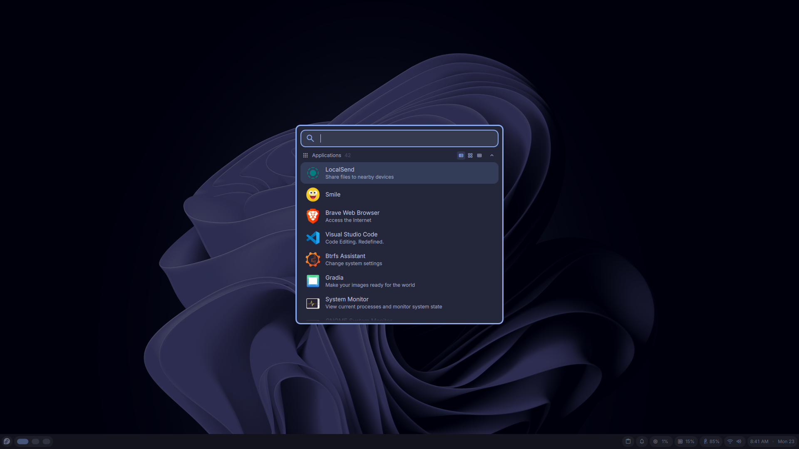
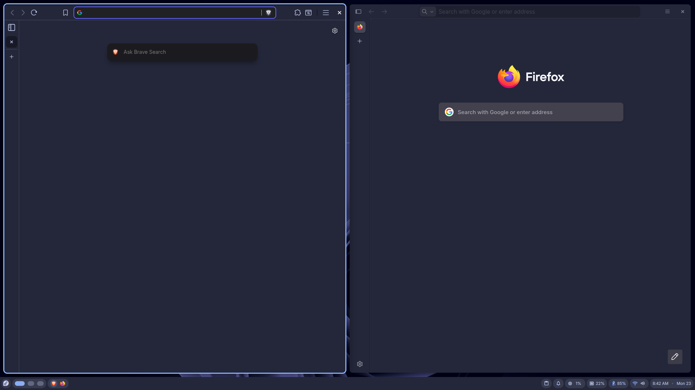
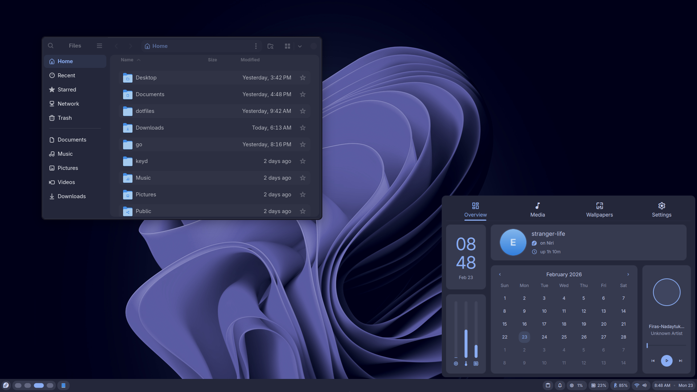

# 🐧 Fedora Workstation

> Optimized for a **majestic, fast, and productive Fedora Workstation** experience.

---

# Desktop Environments

## GNOME

## Niri (Wayland)

---

# Desktop Configuration

### Appearance

* **Theme:** Catppuccin Dark Macchiato
* **Icons:** Kora
* **Cursor:** Sunity
* **Mono Font:** Monaspace Neon NF

---

### Extensions (GNOME)

* ArcMenu
  * Runner launcher
* Tiling Shell
* AppIndicator and KStatusNotifierItem Support
* Caffeine
* Clipboard Indicator
* Just Perfection
* Open Bar
* User Themes
* Vitals

---

# 🛠 Terminal & CLI Tools

### Shell

* kitty
* **zsh** + **oh-my-zsh**

  * zoxide
  * atuin
  * powerlevel10k
  * zsh-autosuggestions
  * zsh-syntax-highlighting
  * fzf-tab

### Terminal

### CLI Utilities

* micro
* fresh
* snapper
* keyd
* pomo
* clatype
* tetro-tui
* harlequin
* lazygit
* gh
* gh-dash
* phpmyadmin
* tldr
* bat
* fd
* fzf
* ripgrep
* aria2
* lsd
* glow
* fastfetch

---

# 💻 Applications

## System

* btrfs-assistant
* Pika Backup
* Extension Manager
* Tweaks
* Flatseal
* rog-control-center

## Work

* VSCode
* virt-manager
* Obsidian
* ONLYOFFICE
* Anki
* Kanri

## Media

* GPU Screen Recorder
* Audacity
* Kdenlive
* Easy Effects
* Video Downloader
* Upscaler
* Gradia

## Web & Communication

* Brave
* Firefox (with betterfox)
* Signal Desktop
* LocalSend
* Bitwarden
* Smile

---

