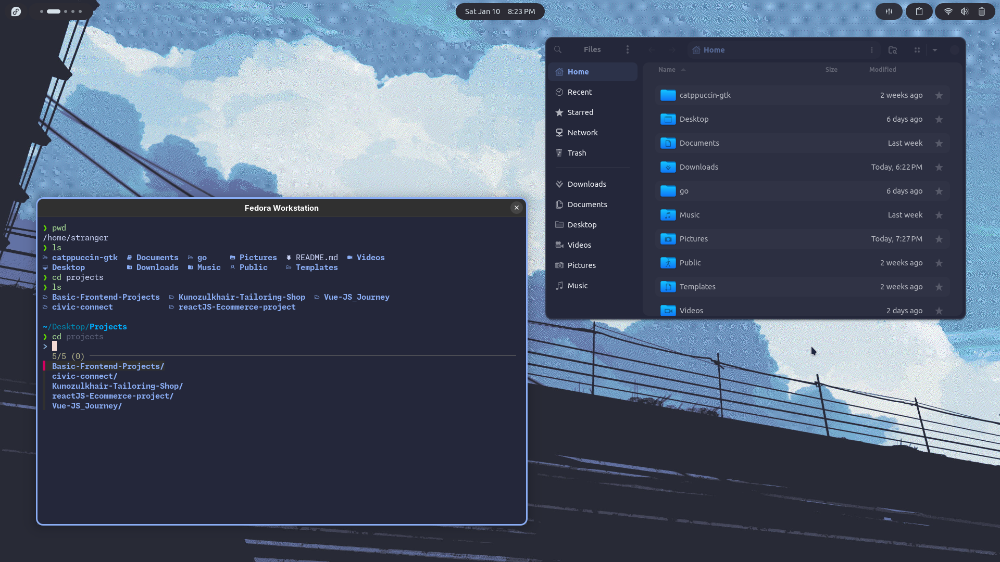

# 🐧 Fedora Workstation

---

## ⚡ My Setup

> Optimized for a **majestic, fast, and productive Fedora Workstation** experience.

---

### 🛠 Terminal & Tools
- **fastfetch**
- **alacritty**
- **snapper**
- **harlequin**
- **lazygit**
- **gh**
- **tldr**
- **bat**
- **glow**
- **fresh (text editor)**
- **zsh** with plugins:
  - `zoxide`
  - `lsd`
  - `atuin`
  - `fzf`
  - `fd`
  - `ripgrep`
  - `oh-my-zsh`
  - `powerlevel10k`
  - `zsh-autosuggestions`
  - `zsh-syntax-highlighting`
  - `fzf-tab`

---

### 🎨 GNOME Tweaks
- **Theme:** Catppuccin Dark Macchiato  
- **Icons:** Kora  
- **Cursor:** Sunity  
- **Font:** Ubuntu NF  
- **Mono Font:** Monaspace Neon NF  

---

### 🔌 GNOME Extensions
Added arcMenu, Tiling Shell, Open bar settings inside Downloads folder.
- `arcMenu`
    - `runner launcher`
- `Tiling Shell`
- `auto move windows`
- `Caffeine`
- `Clipboard Indicator`
- `Dash to Dock`
- `Impatience`
- `Just Perfection`
- `Open Bar`
- `Removable Drive Menu`
- `User Themes`

---

### 💻 My Apps

#### System
- btrfs-assistant
- Pika Backup
- Firewall
- Extension Manager
- Tweaks
- Flatseal
- rog-control-center
- Resources

#### Work
- VSCode
- DBeaver Community
- virt-manager
- Obsidian
- ONLYOFFICE
- Anki
- Kanri

#### Media
- OBS Studio
- Audacity
- Kdenlive
- Easy Effects
- Video Downloader
- Upscaler
- Gradia

#### Web & Comms
- Brave
- Waterfox
- Signal Desktop
- LocalSend

#### Utilities
- Bitwarden

---

<a href="https://www.star-history.com/#EbadShelby/dotfiles&type=date&legend=bottom-right">
 <picture>
   <source media="(prefers-color-scheme: dark)" srcset="https://api.star-history.com/svg?repos=EbadShelby/dotfiles&type=date&theme=dark&legend=bottom-right" />
   <source media="(prefers-color-scheme: light)" srcset="https://api.star-history.com/svg?repos=EbadShelby/dotfiles&type=date&legend=bottom-right" />
   
 </picture>
</a>

