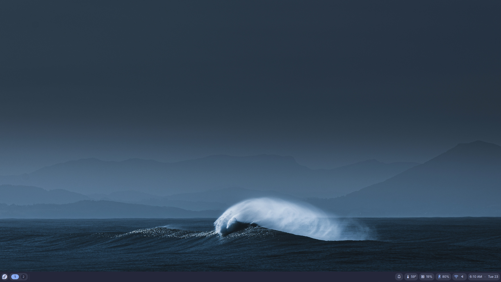
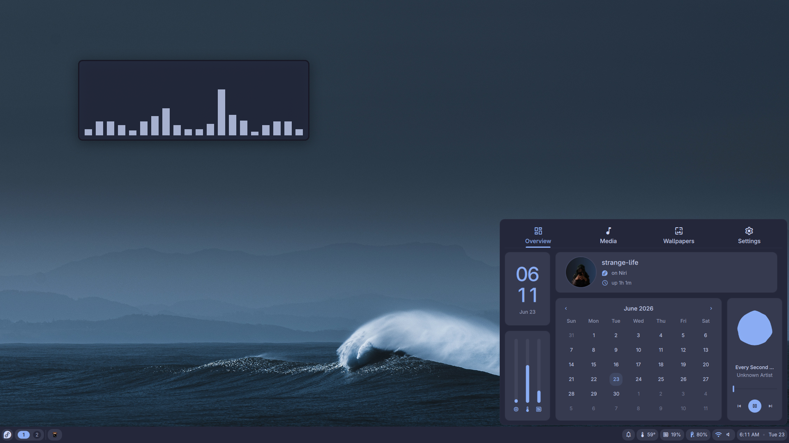
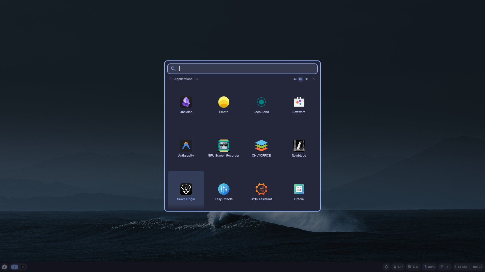
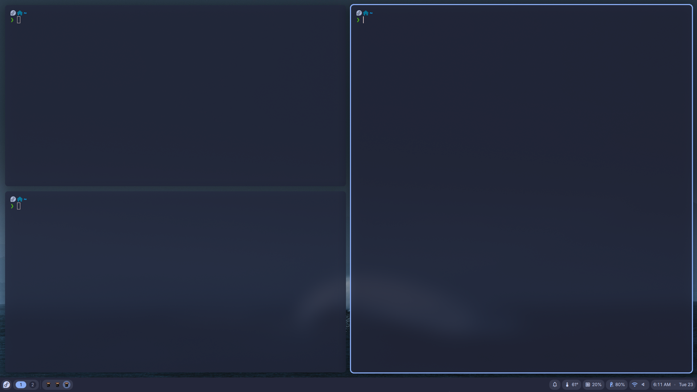
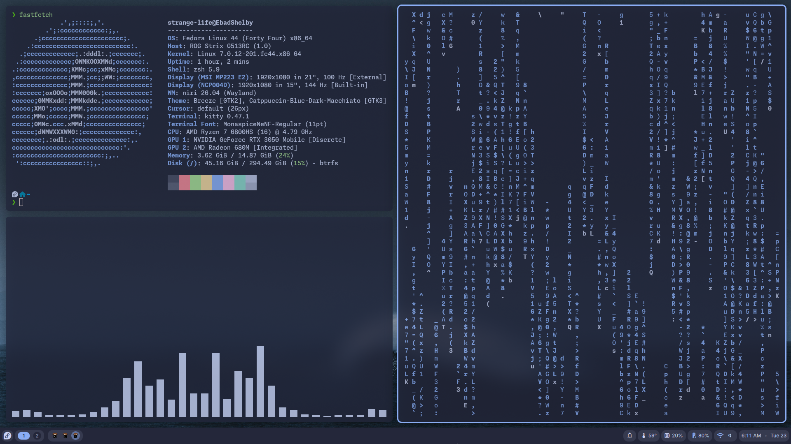
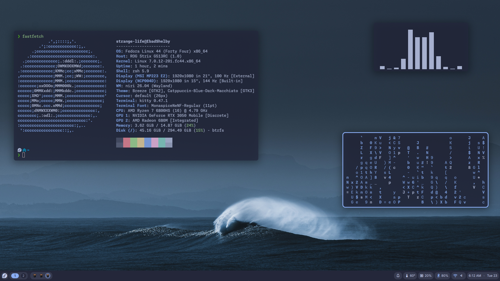
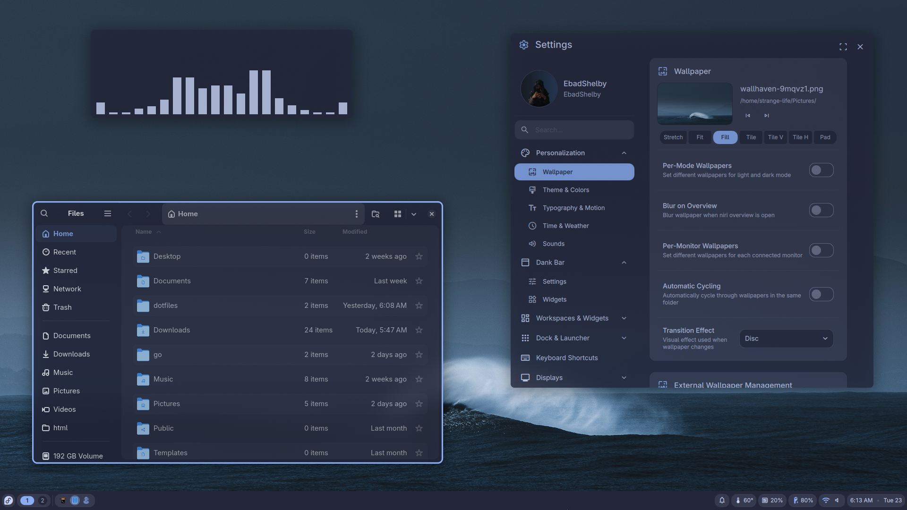
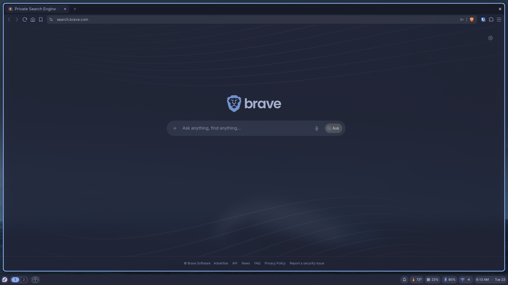
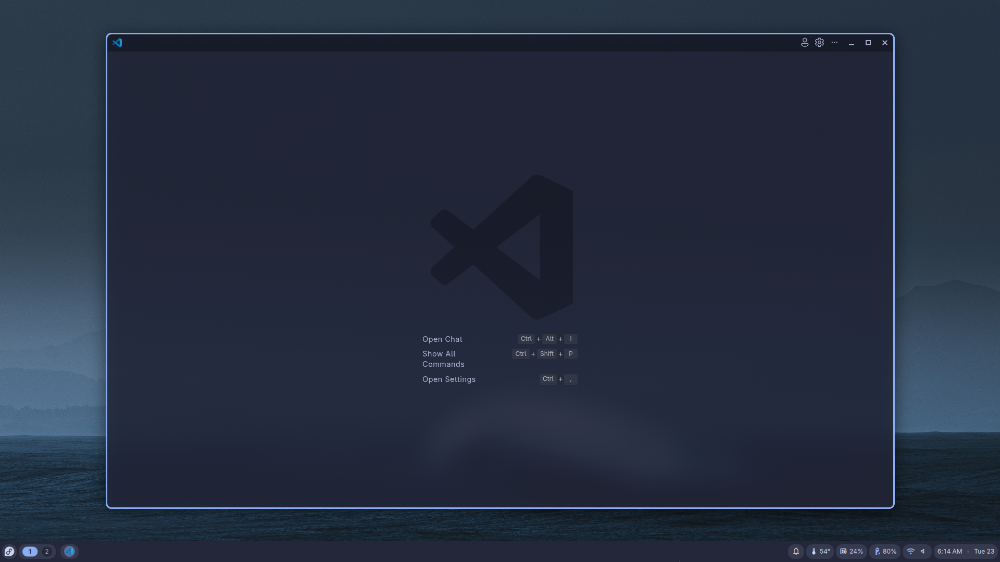

# 🐧 Fedora Workstation

> Optimized for a **majestic, fast, and productive Fedora Workstation** experience.

---

# 📑 Quick Navigation

- [Desktop Environments](#desktop-environments)
  - [GNOME](#gnome)
  - [Niri (Wayland)](#niri-wayland)
- [Desktop Configuration](#desktop-configuration)
  - [Appearance](#appearance)
  - [Extensions (GNOME)](#extensions-gnome)
- [🛠 Terminal & CLI Tools](#-terminal--cli-tools)
- [💻 Applications](#-applications)
- [Star History](#star-history)

---

# Desktop Environments

## GNOME

## Niri (Wayland)

---

# Desktop Configuration

### Appearance

* **Theme:** Catppuccin Dark Macchiato
* **Icons:** Kora
* **Cursor:** Sunity
* **Terminal Font:** Monaspace Neon NF

---

### Extensions (GNOME)

* ArcMenu
  * Runner launcher
* Tiling Shell
* AppIndicator and KStatusNotifierItem Support
* Caffeine
* Clipboard Indicator
* Just Perfection
* Open Bar
* User Themes
* Vitals
* Rounded window corners reborn

---

# 🛠 Terminal & CLI Tools

### Shell

* kitty
* **zsh** + **oh-my-zsh**

  * zoxide
  * atuin
  * powerlevel10k
  * zsh-autosuggestions
  * zsh-syntax-highlighting
  * fzf-tab

### CLI Utilities

* fresh
* snapper
* pomo
* dooit
* xytz
* ghgrab
* glazepkg
* harlequin
* gemini-cli
* opencode
* mycli
* lazygit
* tldr
* bat
* fd
* fzf
* ripgrep
* lsd
* fastfetch

---

# 💻 Applications

## System

* btrfs-assistant
* Pika Backup
* Extension Manager
* Tweaks
* Flatseal
* rog-control-center

## Work

* VSCode
* virt-manager
* Obsidian
* ONLYOFFICE
* Waydroid

## Media

* GPU Screen Recorder
* Audacity
* flowblade
* Upscaler
* Gradia
* EasyEffects

## Web & Communication

* Brave-origin
* LocalSend
* Bitwarden
* Emote

---

## Star History

<a href="https://www.star-history.com/?repos=EbadShelby%2Fdotfiles&type=date&legend=top-left">
 <picture>
   <source media="(prefers-color-scheme: dark)" srcset="https://api.star-history.com/chart?repos=EbadShelby/dotfiles&type=date&theme=dark&legend=top-left" />
   <source media="(prefers-color-scheme: light)" srcset="https://api.star-history.com/chart?repos=EbadShelby/dotfiles&type=date&legend=top-left" />
   
 </picture>
</a>
