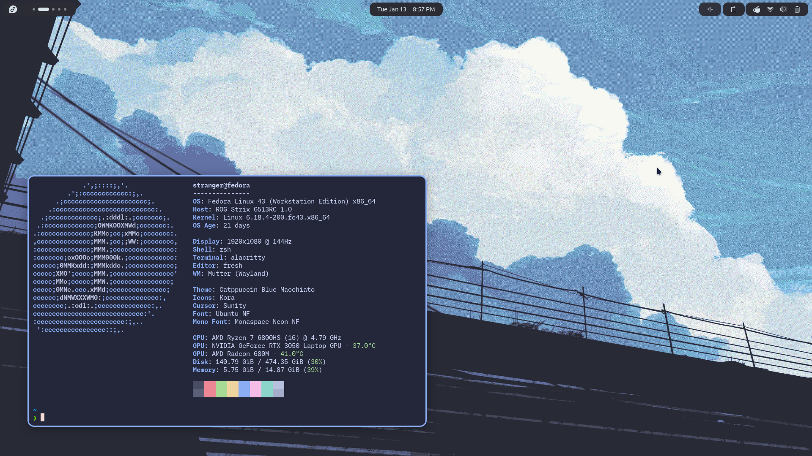
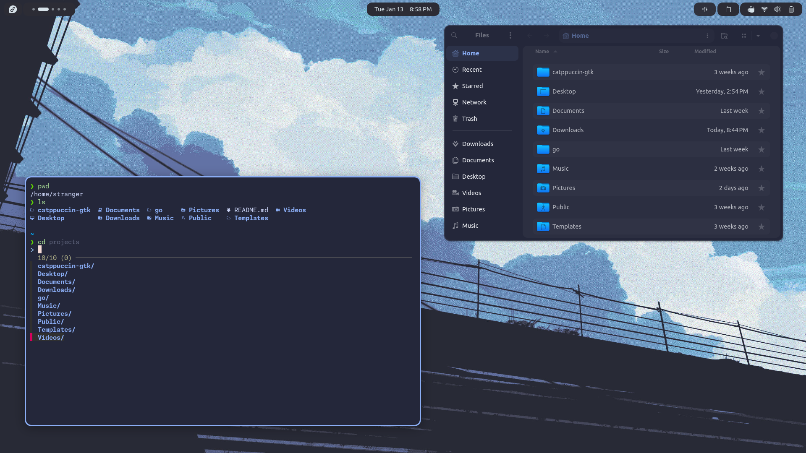
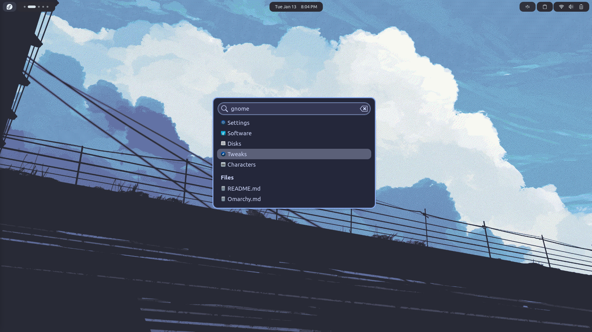
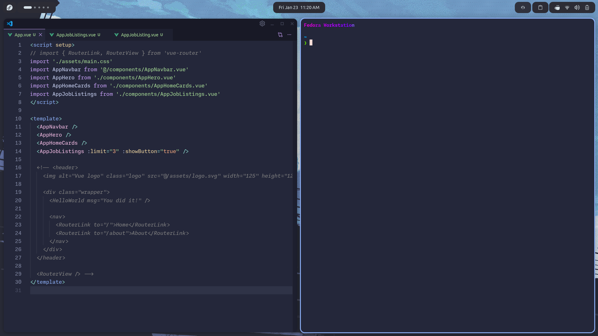
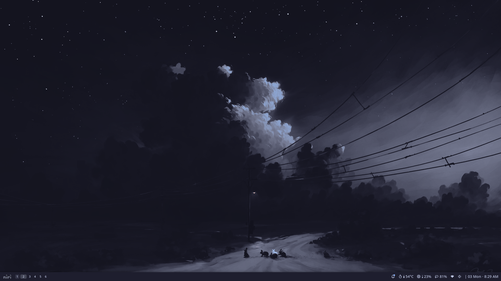
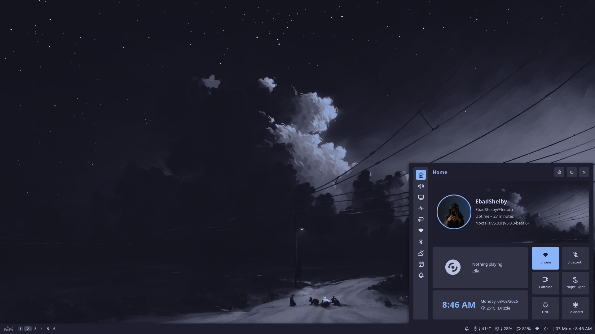
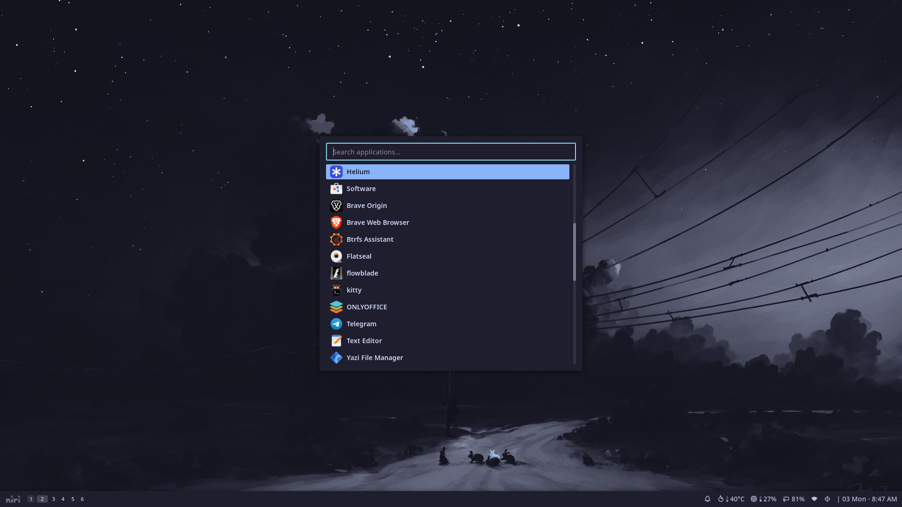
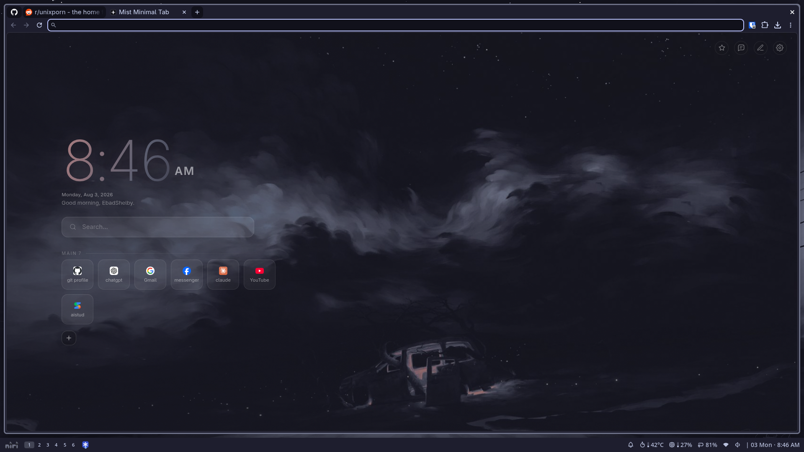
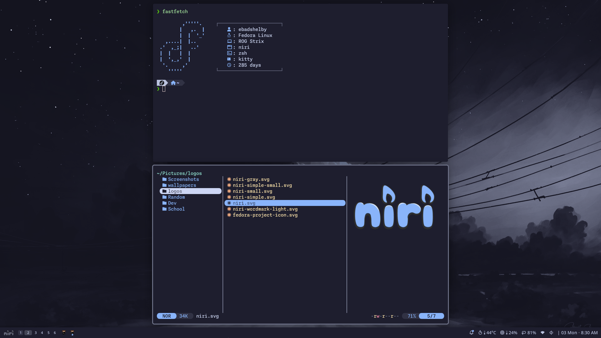

# 🐧 Fedora Workstation

> Optimized for a **majestic, fast, and productive Fedora Workstation** experience.

---

# 📑 Quick Navigation

- [Desktop Environments](#desktop-environments)
  - [GNOME](#gnome)
  - [Niri (Wayland)](#niri-wayland--noctalia)
- [Desktop Configuration](#desktop-configuration)
  - [Appearance](#appearance)
  - [Extensions (GNOME)](#extensions-gnome)
- [🛠 Terminal & CLI Tools](#-terminal--cli-tools)
- [💻 Applications](#-applications)
- [Star History](#star-history)

---

# Desktop Environments

## GNOME

## Niri (Wayland) + Noctalia

---

# Desktop Configuration

### Appearance

* **Theme:** Catppuccin Dark Macchiato
* **Icons:** Kora
* **Cursor:** Sunity
* **Terminal Font:** Monaspace Neon NF

---

### Extensions (GNOME)

* ArcMenu
  * Runner launcher
* Tiling Shell
* AppIndicator and KStatusNotifierItem Support
* Caffeine
* Clipboard Indicator
* Just Perfection
* Open Bar
* User Themes
* Vitals
* Rounded window corners reborn

---

# 🛠 Terminal & CLI Tools

### Shell

* kitty
* **zsh** + **oh-my-zsh**

  * zoxide
  * atuin
  * powerlevel10k
  * zsh-autosuggestions
  * zsh-syntax-highlighting
  * fzf-tab

### CLI Utilities

* **fresh**        - An IDE/text editor in your terminal
* **snapper**      - Btrfs snapshot and rollback manager
* **xytz**         - majestic youtube video downloader
* **fast-cli**     - network speed test on your terminal
* **glazepkg**     - view installed tools from different sources in one view
* **ghgrab**       - terminal tool that lets you browse and download files from GitHub
* **usbtree**      - TUI for inspecting the USB device tree
* **tuistore**     - find, search, and one-key-install hundreds of terminal apps
* **harlequin**    - Full-featured SQL IDE in the terminal
* **opencode**     - AI coding assistant for the terminal
* **mycli**        - Smart MySQL client with autocomplete
* **lazygit**      - Terminal UI for Git
* **yazi**         - Blazing fast file manager tui
* **tldr**         - Simplified command examples
* **bat**          - Better cat with syntax highlighting
* **fd**           - Fast and user-friendly find alternative
* **fzf**          - Fuzzy finder for files and commands
* **ripgrep**      - Ultra-fast text search tool
* **lsd**          - Modern replacement for ls
* **fastfetch**    - Fast system information display
* **podman-tui**   - tui for podman

---

# 💻 Applications

## System

* btrfs-assistant
* Pika Backup
* Extension Manager
* Tweaks
* Flatseal
* Gearlever
* rog-control-center

## Work

* VSCode
* virt-manager
* Helix Notes
* ONLYOFFICE

## Media

* GPU Screen Recorder
* Audacity
* flowblade
* Upscaler
* Gradia

## Web & Communication

* Brave-origin
* LocalSend
* Bitwarden

---

## Star History

<a href="https://www.star-history.com/?repos=EbadShelby%2Fdotfiles&type=date&legend=top-left">
 <picture>
   <source media="(prefers-color-scheme: dark)" srcset="https://api.star-history.com/chart?repos=EbadShelby/dotfiles&type=date&theme=dark&legend=top-left" />
   <source media="(prefers-color-scheme: light)" srcset="https://api.star-history.com/chart?repos=EbadShelby/dotfiles&type=date&legend=top-left" />
   
 </picture>
</a>
